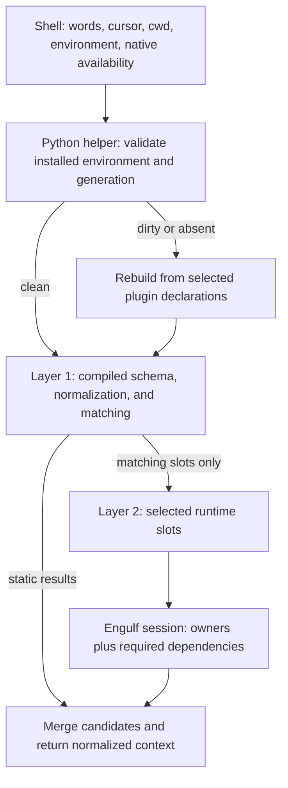

# Compiled autocompletion with selective runtime discovery

Status: implemented baseline. The typed registry extensions, manifest compiler,
generated Python source, runtime-slot evaluator, dependency closure, and atomic
fingerprinted artifact store are available in the executable-wrapper packages.
The full Engulf activation-session and installed-helper integration described in
the later delivery increments remains follow-up work.

The [eclab user stories](compiled-autocompletion-eclab-stories.md) ground this
proposal in `../engulf-clab`'s current declarations, providers, and dependency
metadata. They are part of the acceptance criteria, including behavior that its
current generic provider objects conceal from a compiler.

## Outcome

Generate a Python completion program from the declarations collected from an
application's selected plugins. The program answers static completion requests
without importing those plugins. Explicit runtime slots route dynamic questions
to their owning plugins, activating only the matched owners and their mandatory
plugin dependencies. Installation, removal, upgrades, and other schema changes
invalidate the generated program.

For `exe command <TAB>`, a compiled rule can identify the argument as a runtime
slot owned by `com.example.workspace`. That plugin then inspects the current
directory and command context. Its discovery results are fresh on each request;
the compiled program stores the rule and provider identity, never the directory
contents.

The first implementation generates Python source and immutable lookup tables.
It does not need a native compiler, a daemon, or a new command parser. A clean
request starts one Python helper; a static-only request imports no plugin code.
Runtime discovery uses that same process after matching has selected its owners.

## Existing contracts and gaps

The design starts from these current sources:

- [Registries and completion values](../engulf-executable-wrapper-api/src/engulf_executable_wrapper_api/registry.py)
  expose `ArgumentRegistry.option()`, `CompletionRegistry.candidate()`, and
  `CompletionRegistry.provider()`. Providers and `when` predicates can be arbitrary
  Python callables. Registrations do not currently retain their owning plugin ID.
- [Wrapper setup](../engulf-executable-wrapper/src/engulf_executable_wrapper/goal.py)
  runs argument registration, completion registration, and help collection for
  all selected plugins before a completion request is handled.
- [Current completion](../engulf-executable-wrapper/src/engulf_executable_wrapper/completion.py)
  provides normalization and candidates through one `complete-context` request.
  It still launches the wrapper and constructs its application on each request.
- [Application construction and invocation](../engulf/src/engulf/application.py)
  eagerly materialize selected plugins and run setup. Ordinary invocation also
  enters outer lifecycle hooks before reaching the goal's completion branch.
- [Discovery and ordering](../engulf/src/engulf/plugin_loader.py) read installed
  entry-point identity and dependencies without importing targets, but obtain
  priority, context declarations, and other plugin metadata after import.
- [PluginDependency](../engulf-api/src/engulf_api/dependencies.py) always requires
  the target to be active. `before`, `after`, and `none` describe ordering in a
  particular phase; `none` does not make the dependency optional.

Compilation may activate the full selected plugin set once to collect declarations.
Plugin authors do not have to duplicate those declarations in wheel manifests.
Import-free metadata is needed to validate the resulting artifact and choose
runtime targets; it can be generated during collection.

## Package ownership

Introduce two typed distributions so plugins do not depend on runtime code:

| Distribution | Responsibility |
| --- | --- |
| `engulf-completion-api` / `engulf_completion_api` | Existing registry/value contracts, immutable schema types, declarative matchers, and runtime-slot markup; no runtime imports. |
| `engulf-completion` / `engulf_completion` | Schema compiler, generated Python evaluator, matching, normalization, result merging, and host adapter protocols. |
| `engulf-executable-wrapper-api` | Reexports existing completion names, adds the wrapper-specific discovery phases and callback API. |
| `engulf-executable-wrapper` | Collects wrapper declarations, binds runtime slots, supplies Engulf adapters, installs shell glue, and composes native completion. |
| `engulf` | Owns metadata discovery, policy validation, dependency plans, managed execution sessions, endpoints, diagnostics, state, and cleanup. |

Move the existing registry/value implementations to the completion API package,
with reexports retaining object identity. Preserve their current fields and
registration call shapes. The completion API remains dependency-free;
`engulf-executable-wrapper-api` depends on it and `engulf-api`. The compiler depends
only on the completion API, with adapters supplied by its host. Neither generic
Engulf package imports a completion or executable-wrapper package.

The library is usable independently through `SchemaSource`, `EnvironmentProbe`,
`ArtifactStore`, and `RuntimeResolver` protocols. Engulf supplies those adapters;
the library does not invent a second plugin manager or state-locking system.
Keep the existing `engulf-completion` console command owned by the wrapper during
the initial integration; do not install a second script with the same name.

## Layers and request flow



The environment check is a small bootstrap, not an application startup. On a clean
request it never calls `ApplicationDefinition.create()` or imports the application's
plugin targets. It checks the generation before importing generated Python.

The compiler emits lookup tables for option aliases, argument arity, assignment
handling, visibility, literal candidates, rule predicates, provider ownership, and
stable merge order. It also emits dispatch decisions for runtime slots. Built-in
declarative operations such as file or directory listing can execute directly in
the helper; plugin-specific operations are represented by runtime references.
The runtime layer consequently has two target kinds: library-owned operations
requiring no plugin activation, and plugin-owned discovery requiring a session.
Filesystem listing remains fresh runtime work even when its instructions are
compiled into the program.

## Accepting current declarations

The library accepts the same registrations used today:

```python
registry.option(
    "--profile", "-p",
    takes_value=True,
    metavar="PROFILE",
    description="Select a profile",
    value_completer=provider,
    visible_to_binary_completion=False,
    suggest_assignment=True,
    repeatable=False,
    when=predicate,
    environment="APP_PROFILE",
)
registry.candidate("command", description="Inspect a workspace", when=predicate)
registry.provider(provider)
```

The collection adapter supplies an owner-bound registry facade during each managed
registration callback. Each record retains the actual declaring owner, phase,
registration ordinal, and static fields. Plugins cannot claim another owner's ID
by passing it as a registration argument. Goal-owned registrations use a separate
owner kind, not an invented plugin ID.

The registries retain today's read interface. During selective registration replay,
reads see the frozen declarations visible at the corresponding point in the original
phase/registration order, including earlier declarations from inactive owners.
Do not expose later declarations ahead of their original registration. Writes are
restricted to rebinding the current owner's records. A plugin must not depend on
another plugin's live callback object or change another owner's record. Such behavior
is outside the compiled contract.

| Declaration | Compiled representation |
| --- | --- |
| Literal option/candidate and its documentation | Static record. |
| Declarative `when` matcher | Pure matching rule in generated code. |
| Explicit runtime provider | Owner plus stable provider ID and a matching rule. |
| Existing bare `value_completer` callable | Owner-local runtime slot, matched only at that option's value position. |
| Existing bare `provider()` callable | Owner-local runtime slot with an always-match rule. |
| Existing Python `when` callable | Runtime boolean slot; never evaluated and frozen at build time. |
| Provider/predicate with an explicit declarative export | Lower its exported instructions rather than treating it as opaque Python. |
| Framework-owned completion logic | Compiled rules or library-owned dynamic operations. |

Bare global providers remain valid, but their owners may load on every TAB. Narrow
markup is what makes those registrations selective. For a runtime predicate,
statically impossible candidates are discarded before loading its owner. If it
cannot be decided statically, the owner must load to evaluate it.

Legacy binding IDs are derived from owner, registration phase, and slot ordinal.
An option's aliases and callable role are also recorded for verification. These IDs
are valid only within the exact compiled generation. Explicit IDs are preferred for
new providers. No callable, bound instance, closure, or retained registration API is
pickled or embedded in generated Python.

### Declarative exports from existing provider objects

Eclab already adapts `PluginSchema` declarations into `_ValueCompleter`,
`_CommandCompleter`, and `_CommandPredicate` objects. They often contain entirely
static data, despite appearing to the wrapper as arbitrary Python providers.
Treating every one as a runtime slot would activate many plugins even for a list
of commands or enum values.

Add an optional `describe_completion() -> CompletionSpec` protocol that provider
and predicate objects can implement. It runs only during collection and returns
immutable typed instructions: literals with descriptions/defaults, finite matching
rules, known command/flag/positional tables, library-owned path operations, runtime
references, or a composition of these. Its contract prohibits fact-finding while
describing a provider. An opaque object without this method retains the runtime
fallback described above; do not inspect its class name, private fields, bytecode,
or source to guess an export.

The eclab schema adapter implements the protocol or constructs exportable generic
providers from its `OptionDeclaration` values. Plugins continue to use the same
`register_arguments()` and `register_completions()` calls. The new library contains
no eclab-specific imports or schema compiler invocation.

The initial generic instruction set must handle the eclab cases already expressible
through those declarations: command aliases, scoped flags, repeatable positionals,
skipping known flag values when counting positionals, `--`, literal/boolean values,
defaults, descriptions, and file versus directory discovery. This is an explicit
completion grammar supplied by the adapter, not a parser inferred from arbitrary
Python. Preserve the distinction between command-scoped completion records and
global `ArgumentRegistry` options; exporting a scoped flag must not make it a
global option consumed by invocation normalization.

Support compositions such as `Union(Literals(...), Paths(...))`: finite suggestions
can be generated without a plugin, while path results remain fresh. A typed value
with some explained examples is an open set; compilation must not turn those
examples into runtime validation or an exhaustive enum.

## Runtime-slot markup

Use typed Python markup rather than magic strings embedded in candidate values.
The proposed authoring surface is illustrated below; these names are not yet APIs:

```python
from pathlib import Path
from engulf_completion_api import Match, Runtime


def register_completions(self, registry, api):
    registry.candidate("command")
    registry.provider(
        Runtime(
            "workspace-items",
            self.complete_workspace_items,
            when=(
                Match.words_prefix(("command",), view="binary")
                & Match.cursor_at(1, view="binary")
            ),
        )
    )


def complete_workspace_items(self, context):
    # The helper runs in the requesting shell's cwd. The engine filters prefixes.
    return sorted(path.name for path in Path.cwd().iterdir())
```

For an option value, no explicit position selector is needed:

```python
registry.option(
    "--profile",
    takes_value=True,
    value_completer=Runtime("profile-names", self.complete_profiles),
)
```

The compiler automatically gates that slot on the existing separate-value and
`--profile=value` semantics. An optional explicit matcher further narrows this
implicit selector. `when` on an option still controls offering the option itself;
it does not silently change how a supplied value is completed.

Each frozen runtime reference contains:

```text
owner_kind: plugin
owner_id: com.example.workspace           # stamped by managed registration
provider_id: workspace-items
result_kind: candidates                   # or predicate
binding: register_completions/provider/0  # checked during selective replay
selector: binary words start with [command] AND binary cursor index == 1
generation: <schema digest>
```

The reference is resolved through the validated catalog and captured registration,
not through an arbitrary module path supplied in a shell request. IDs are unique
within an owner; duplicate explicit IDs are registration errors. Multiple slots may
refer to one provider, but calls coalesce only when the effective provider context
is identical. Different option-value contexts require separate evaluations.

The initial matcher vocabulary includes word-prefix and cursor tests, current-word
prefix, previous option, option presence, before/after `--`, and `all`/`any`/`not`.
Matchers explicitly choose original wrapper words or normalized binary words;
indexes are zero-based and exclude the executable. Normalization is fully derived
from the static option schema before runtime matching starts. Runtime predicates
may filter candidates, but cannot redefine option arity or hiding rules mid-request.

There is no inferred command grammar: matching `command` at a known word position
does not understand arbitrary child options that take values. An adapter may supply
the explicit command/positional nodes described above. Keep this separate from the
[goal-owned parser proposal](goal-owned-cli-parser.md).

## Compilation and binding

On explicit installation/refresh or the first request after invalidation:

1. Capture a fresh metadata snapshot and resolve the application's full eligible
   plugin set using its actual policy, required IDs, goal contract, and declaration
   lineage. Validate dependencies using the normal Engulf rules.
2. Materialize that selected set and collect registrations through owner-bound
   facades in the existing phase order: all argument registrations, then all
   completion registrations. Keep goal-owned logging and installer completions.
3. Capture immutable plugin metadata, observed source identities, dependency edges,
   and both resolved plugin orders. These are cached observations, not trust grants.
4. Lower static records and declarative matchers into the schema. Replace callables
   with runtime references without invoking them. Do not collect help or run a
   normal command invocation merely to compile completion.
5. Generate deterministic Python source and a data manifest. Emit constants as
   escaped literals or validated data; never splice candidate text into code.
6. Recheck the environment generation, then atomically publish the artifact. If the
   environment changed during collection, discard the build and retry once.

Registration must describe stable structure. Cwd listings, current machines, open
sessions, and other volatile facts belong inside runtime providers. A plugin that
loops over `Path.cwd()` while registering literal candidates would freeze those
values; the compiler cannot automatically infer that hidden dependency. The same
restriction applies to arbitrary branching in application construction. Authors
must move such work behind a runtime slot, or declare configuration inputs that
invalidate the schema. Compilation is not symbolic execution of arbitrary Python.

During runtime activation, only the selected owners and dependency closure replay
registration. Replay re-creates their live callable bindings and checks the owner
records against the compiled generation. Matching never uses newly invented
registrations from that replay. A mismatch marks the artifact dirty and requests a
rebuild; it does not use a changed slot ordinal to call the wrong provider.

Goal-owned dynamic providers have an explicit application binding adapter, invoked
only when one of their slots matches. The adapter may create the goal and rebind
its providers without activating the full application plugin set. Ordinary app
construction is not an acceptable hidden fallback for that operation.

## Selective activation and dependencies

Distinguish eligibility from materialization:

- `E` is the complete plugin set permitted and selected by application policy.
- `R` is the set of plugin owners of runtime slots matching this request.
- `A` is the least set containing `R` and every mandatory `PluginDependency` target
  reachable from any member of `A`.

Compute `A` from the validated manifest before importing any target. Require
`A` to be a subset of `E`. Policy decides whether a dependency is eligible; a
completion request cannot implicitly unblock one or change `include_dependencies`.
Missing dependencies and missing application-required IDs invalidate the plan.

Presence closure follows dependency declarations, regardless of their phase
positions. Do not compute it by taking ancestors of the ordering graph: an `after`
edge points in the opposite direction from the presence requirement. Do not load
unrelated dependents merely because their ordering edges mention a requested owner.

Filter the validated full preprocessing and postprocessing orders to `A`. This
preserves ordering edges, original discovery tie-breaks, and collection order.
Higher priority breaks ready-node ties in the original Engulf resolution; it never
overrides a dependency. Postprocessing is its own order, not reversed preprocessing.
If dispatch receives an explicit `plugin_ids` sequence, pass this ordered sequence:
the current dispatcher preserves an explicit sequence rather than sorting it.

Example, using the dependency's position relative to its declaring plugin:

```text
workspace depends on configuration: preprocess=before, postprocess=after
configuration depends on schemas:   preprocess=before, postprocess=after
workspace depends on telemetry:     preprocess=none,   postprocess=after

Matched slot owner: workspace
Active closure: schemas, configuration, workspace, telemetry
Required preprocessing chain: schemas -> configuration -> workspace
Telemetry preprocessing position: existing priority/discovery tie-breaks
Unrelated image and network plugins: not imported
```

Telemetry is still mandatory even though it supplies no completion candidate.
Every member of `A` receives completion setup/preparation; only matching provider
IDs run candidate or predicate discovery. A dependency's unrelated providers do
not run just because its plugin was activated. One request creates at most one
instance/endpoint per owner, shared across that request's matched slots.

The concrete eclab vrnetlab provider currently has a six-plugin mandatory closure:
`vrnetlab_build`, `ensure_vrnetlab`, `lab_parser`, `image_build`, `lab_writer`, and
`schema` (all under `engulf_clab`). The last three enter through `after` dependencies,
including transitive ones. Respecting today's contract therefore costs more than
the owner plus its two immediate `before` prerequisites. Reducing this to a separate
completion dependency graph would require a new explicit presence contract; do not
silently reinterpret existing hard dependencies as optional for completion.

## Managed completion session

The current `Application` constructor is too eager for the clean request path.
Extract a generic internal activation-plan/session facility from its existing
machinery. Application runtime remains responsible for policy checks, endpoint
creation, resources, diagnostics, and closing. The wrapper supplies the completion
mode and its phases. Core does not gain shell or completion-specific imports.

The session is new implementation work; passing a narrower `plugin_ids` list to
today's goal dispatch cannot undo plugins already imported during construction.
Do not implement a second direct callback loop around live plugin instances.

The wrapper API adds completion-specific preparation, discovery, and finalization
phases, with module-level forwarding adapters and stable phase IDs:

1. Revalidate the requested generation and catalog sources; materialize `A`, and
   verify the imported metadata/goal type against the cached observations.
2. Replay argument and completion registration to bind owner-local callables.
3. Run completion preparation for `A` in preprocessing order. This is where a
   prerequisite supplies declared context needed by its dependents.
4. Evaluate matched runtime predicates, then the still-required candidate providers,
   in preprocessing and registration order. Each phase returns immutable attributed
   results; providers never observe peers' pending contributions.
5. Finalize entered participants in postprocessing order, close callback APIs, and
   close every materialized endpoint, including on errors or interrupts.

The default discovery adapter invokes that owner's rebound callables within a
managed goal phase at its endpoint. Bound callables remain local session details;
immutable events carry provider IDs and contexts, not callable objects. The owning
goal keeps these bindings private; no live implementation access is added to public
application inspection. A future transport would need an explicit provider codec.

Completion preparation/finalization default to no-ops. Normal `before_goal`,
`after_goal`, `analyze_call`, and process preparation are not used by this mode.
Existing providers depending on side effects of those hooks must move the necessary
read work to the completion phases. A `before` dependency guarantees callback
ordering; it does not automatically turn normal command work into discovery work.

Track successful preparers explicitly. On preparation failure or interruption,
unwind completed preparers in reverse preparation order; a preparer releases its
own partially acquired resources before raising. Finalization attempts all entered
participants even after a cleanup error. Use existing context declarations,
leases, state namespaces, and callback lifetimes. Never retain registration APIs
in provider closures, and never request privilege elevation as a completion action.

Selective activation is an optimization. The imported plugin and its transitive
Python imports still have the helper's OS authority; it is not a sandbox or a
promise that a plugin's module does not import other modules itself.

## Dirty generations and artifact storage

An artifact key includes application ID, launcher/interpreter identity, goal/API
identity, schema/compiler versions, effective policy and required IDs, declaration
lineage, completion configuration, and descriptive metadata used by registrations.
Editions sharing an application ID may have different policies and option prefixes,
so application ID alone is not a sufficient cache key. Presentation fields affect
cache output only; they do not become authorization identities.

Record an environment fingerprint containing the active Python search roots,
distribution locations and versions, relevant entry-point values, dependency
metadata, and installation-record identities. Capture all metadata search roots,
including the user site when enabled, so a newly installed provider is detectable.
Same-version replacement must invalidate too; a version-only fingerprint is wrong.

| Change | Required behavior |
| --- | --- |
| Plugin installation or removal | Mark dirty on the next request before using stale schema or loading a provider. |
| Upgrade or same-version reinstall | Compare installed metadata/record identities and rebuild. |
| Policy, launcher, goal, or declared configuration change | Recompute the artifact key or invalidate its generation. |
| Editable or directory plugin source change | Compare tracked source/resource fingerprints, including tree additions/removals, and rebuild. |
| Cwd contents or other discovered facts change | Keep the schema; execute matching discovery against the new state. |
| Provider binding/schema mismatch | Invalidate and rebuild, with a bounded retry. |

Do not assume ordinary package installers call an Engulf hook. The initial reliable
implementation performs a fresh import-free installed-metadata comparison on every
request. Reading installed metadata is allowed on the static path; importing plugin
targets is not. This has a measurable cost and must be included in benchmarks.
A managed installer may additionally advance an environment epoch immediately;
that is an acceleration hint unless every installation route is controlled.

Start conservatively by tracking the installed distribution inventory as well as
the relevant catalog contents. Unrelated package changes may cause unnecessary
rebuilds; refine that only after proving installation/removal detection. Do not rely
only on directory mtimes, a TTL, or the previous list of plugin names, which would
miss new or same-version providers.

Editable and directory plugins require a restartable source locator and tracked
source roots/resources. The first collection may import directory plugins to learn
IDs, as it does today; a clean request uses the generated ID-to-file index. Source
changes invalidate that index before selective loading. Direct in-memory plugin
objects without a restartable binding cannot support an installed helper and should
produce a compile-time diagnostic. There is no silent all-plugin hot-path fallback.

Store artifacts through the goal's managed user-state namespace and existing
owner-private, no-follow, lock, and atomic-write facilities. The generic internal
session must allow the host to obtain that store without first importing plugins.
The standalone library receives a store adapter instead of accessing Engulf state.

Publish one immutable bundle containing manifest and generated source, addressed
by its digest; atomically update a small current-generation pointer last. Readers
never combine a manifest from one generation with code from another. A per-artifact
Engulf lease coordinates compilation; acquire it before state transactions, and
release state locks while executing registration callbacks. Recheck the generation
after collection and before publication. Compilation is idempotent after a crash.

Recheck the environment before activation and before returning the response. If an
installation races with a request, discard results from the changed generation and
retry once, then return an unavailable status. Metadata checks cannot make an
uncooperative external installer atomic; never report stronger guarantees.

A dirty artifact is not used for either static results or activation. Rebuild within
the request's budget; if a concurrent build, error, or continuing change prevents
that, return an empty Engulf result with diagnostic status. Native shell completion
may still supply results. Provide explicit refresh/inspect commands so a slow or
failing rebuild can be completed and diagnosed outside an interactive TAB.

## Request, response, and shell integration

Use one versioned, bounded request/response carrying exact string values. A
length-framed UTF-8 JSON encoding with escaped surrogate code points is suitable
for the Python boundary; shell adapters may keep counted NUL records. Do not split
words on whitespace or use newline-delimited strings for candidate transport.

The request contains wrapper identity, shell, original words including the trailing
empty word, cursor index, cwd, environment snapshot, native-completion availability,
and deadline. The provider-facing `CompletionContext` retains its existing fields;
the managed discovery event also carries cwd and immutable environment explicitly.
Legacy callables run in the helper's inherited cwd/environment. New providers should
use the explicit snapshot and keep discovery read-only. Environment values and
runtime results are never persisted in the compiled artifact.

Keep three explicit views: original wrapper words, normalized binary words, and an
option-value context where only the current token is replaced by the value prefix.
The provider must still see previous wrapper options: eclab's vrnetlab provider uses
them to suppress already-used `NODE=PATH` selectors. The shell-facing reply then
reattaches only the outer option prefix; inner `NODE=` and directory `/` suffixes
must survive. Hidden wrapper values suppress native/binary fallback work, not their
own plugin provider.

The request also has an effective environment for explicit discovery phases. Build
it from inherited values plus fully supplied environment-bound options, with CLI
values winning, without consuming or rewriting the provider's words. Exclude the
incomplete current value, respect `--`, and tolerate an incomplete command line.
An invalid/ambiguous completed binding contributes no override and produces a
diagnostic; it must not start normal invocation validation or command hooks.
Legacy callbacks still see inherited process environment; providers requiring CLI
overrides must use the explicit discovery event. Do not mutate process globals to
simulate another request's environment.

Library-owned path instructions explicitly specify file/directory filtering and
their base. Cwd-relative paths can use built-in discovery directly. A topology-relative
base is a plugin-owned fact until the application supplies an exportable resolver;
do not assume every path is relative to cwd. Cache topology reads at most within a
request, keyed by selected path and effective environment. Eclab's parser owns YAML
inheritance, env-file loading, and expansion; the generic library must not duplicate
those semantics or fetch URL/stdin topologies during interactive completion.

The response contains the generation, normalized binary words and cursor, whether
the current word is hidden from binary completion, attributed candidates, and status.
Preserve descriptions through merging even when a shell displays only values.
Deduplicate by candidate value with stable order and the existing preference for a
nonempty description when an earlier duplicate lacks one.

Resolve native completion availability in shell glue before sending the request,
including the existing explicitly opted-in sourcing attempt. Availability lookup
does not require normalized arguments. Then the one helper call can skip fallback
binary-provider activation entirely. Native completion itself runs afterward with
the returned normalized context. Preserve `_minimal` handling, wrapper-only value
hiding, assignments, separator behavior, Bash word-break reconstruction, and the
trailing space for an empty current word.

Associate the shell's native-availability report with the service/source descriptor
it inspected. If a rebuild changes that descriptor, return a refresh response before
running plugin discovery or fallback providers. The shell updates its descriptor,
rechecks native completion, and retries once. This extra invocation is limited to
the changed-descriptor path; clean requests retain one helper invocation. Existing
sourcing-attempt markers must be keyed by descriptor so an old attempt does not
prevent sourcing the newly configured executable.

For a provider error, stop the failing managed phase and return the independently
computed static candidates with an attributed partial-result diagnostic; discard
all dynamic results from that failed request. Cleanup failures are also reported.
For a stale generation, return no Engulf candidates. Keep plugin/log output off the
protocol channel using a dedicated result stream; stdout prints must not corrupt
framing. A cooperative deadline covers normal work; the shell-side runner enforces
a hard timeout because arbitrary synchronous plugin code cannot be cancelled by
merely checking a timestamp. Timeout cleanup is best effort, reinforcing why
completion must not perform resource-creating command work.

## Delivery and acceptance

Implement in these increments:

1. Extract the completion API and compiler model, retaining the current declaration
   surface. Add owner attribution, matchers, runtime references, and deterministic
   schema generation. Include declarative provider exports so eclab's schema-backed
   command and value providers can lower to instructions. Validate the model
   independently with an in-memory resolver.
2. Build generated Python evaluation and an adapter that collects all selected
   registrations. Add artifact manifests, fresh metadata validation, managed stores,
   atomic publication, and explicit refresh/inspection.
3. Separate generic activation planning from endpoint materialization within Engulf.
   Add managed completion phases, binding replay, dependency closure, and failure
   cleanup. Keep ordinary application construction/invocation behavior intact.
4. Route installed shell integrations through the generated helper. Preserve the
   single-request clean path and native completion semantics. Retire the all-plugin
   completion path once compilation supports the application's registrations.
5. Convert built-in completion and representative plugins to narrow runtime markup,
   document migration of volatile registration and normal-hook dependencies, and
   benchmark clean/static, clean/dynamic, and dirty requests separately.

Acceptance requires behavioral and import-observation tests:

| Scenario | Required evidence |
| --- | --- |
| Static-only TAB | One helper process, no plugin imports/factories/registration/hooks, equivalent candidates. |
| `exe command <TAB>` | Only the matched owner and mandatory dependency closure import; modifying cwd contents changes the next result without recompilation. |
| Multiple slots and shared prerequisites | One endpoint per owner; fresh context per request; equivalent binding contexts coalesce once. |
| `before` chain with conflicting priorities | Dependencies prepare before their dependents; priority cannot reverse an edge. |
| `after`, `none`, and reverse dependents | Mandatory targets activate; unrelated dependents stay unloaded; postprocessing uses its own order. |
| Install/remove/upgrade/reinstall | Next request observes the change, with no reliance on a custom installer hook; removed providers never load through a stale artifact. |
| Application policy and editions | Cache separation follows effective configuration; requests cannot activate blocked or incompatible plugins. |
| Legacy callables and predicates | Correct runtime evaluation, attributed failures, and explicit always-match cost where selectors are absent. |
| Replay mismatch | No wrong-provider dispatch; bounded invalidation/rebuild behavior. |
| Concurrent compile or environment mutation | No mixed bundle, partial publication, indefinite retry, or deadlock. |
| Provider/preparation/finalization failure and interrupt | Correct attribution, dependency failure prevents dependent work, all required cleanup is attempted. |
| Shell edge cases | Empty words, spaces/newlines/quotes, assignments, `--`, option aliases, native precedence, and hidden values retain correct behavior. |
| Artifact and result injection | Text stays data; symlink/owner protections hold; candidate or logging output cannot corrupt protocol framing. |

Also run the concrete scenarios in the [eclab story matrix](compiled-autocompletion-eclab-stories.md):
literal strategies, cwd directory arguments, topology-dependent node/path selectors,
edition gating, and refusal to enter command side effects while completing them.

Measure end-to-end latency, metadata-probe time, imports, activation count, and
provider time. Removing full application startup is the expected benefit; do not
claim a fixed speedup before measurement. A bare global provider can still activate
its closure on every request, and dirty rebuilds intentionally pay the full
registration cost.

Implementation adds contract tests to the new API and the wrapper API, library tests
to the compiler, and activation/lifecycle tests to Engulf. Run the workspace checks
from [AGENTS.md](../AGENTS.md). When adding the distributions, extend build, type,
test, and packaging configuration to include them and validate wheels/sdists with
`make build`. This proposal itself changes no runtime or package versions.
