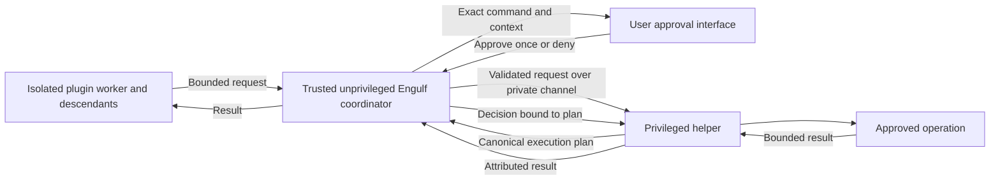

# Managed sudo access

Status: proposed; implementation has not started.

The [design review and feasibility work](managed-sudo-access-feasibility.md)
defines the next implementation slices, request state machine, release gates, and
limited Linux smoke-test evidence. The review refines this proposal; it does not
establish a working privilege boundary.

## Objective and recommendation

Allow an application that rejects elevated startup to perform selected privileged
actions without elevating the application or its normal plugins. A plugin submits
a request; Engulf presents the exact proposed command and execution context; the
user approves that request before a separate helper performs the action.

Treat prevention of unmanaged elevation as a requirement for this design. That
requires OS isolation before untrusted plugin code runs. A command approval API
for today's trusted, in-process plugins is independently useful, but cannot satisfy
that requirement. Do not advertise an approval-only implementation as containment.

The enforceable promise is about authority: restricted plugins and their descendants
cannot obtain host privilege through an unapproved route within the supported
isolation profile. It need not prohibit starting a program named `sudo`; it must
prevent that program from gaining authority. Approved actions receive only their
reviewed scope. Arbitrary root execution is a materially broader grant.

## Current foundations and gaps

- [Normal plugins](../engulf/README.md#execution-and-trust) run in the application
  process. They can access its memory, files, subprocess APIs, and inherited OS
  authority. Replacing `subprocess.Popen`, hiding `sudo` from `PATH`, or checking a
  plugin's declared elevation requirement cannot contain malicious code.
- The existing [execution endpoint](../engulf/src/engulf/_plugin_execution.py)
  provides a place to add isolated execution. It currently forwards directly to
  plugin implementations. Discovery/import, factories, registration, and lifecycle
  handling also need isolation; moving phase callbacks alone is insufficient.
- [Elevated startup consent](../engulf/README.md#elevated-goal-opt-in) and
  `ElevationRequirement` describe startup compatibility. Preserve them:
  `api.elevated` stays false for this unprivileged application, and `REQUIRED`
  still rejects an unprivileged host. Namespace-local root is not host elevation.
  A separate declaration can express a required managed operation; it must not
  reinterpret `REQUIRED` as permission to use sudo.
- [Diagnostic workers](../engulf/README.md#isolated-diagnostic-extensions) establish
  isolation before importing targets and use bounded JSON. Their restricted,
  short-lived contract is a useful reference, not a ready-made normal-plugin backend.
- The planned [plugin services transport](plugin-services/transport/README.md) is
  cooperative IPC. Its configuration plugin called a broker is explicitly not a
  privilege broker. Neither those interfaces nor isolated normal workers exist yet.

Python itself documents that Python-level audit hooks are unsuitable as a sandbox.
They can support diagnostics, but must never be the enforcement boundary.
[Python audit-hook documentation](https://docs.python.org/3/library/sys.html#sys.addaudithook)

## Threat model

Assume a selected plugin may execute arbitrary Python, native code, or subprocesses,
including during import. It may forge requests, retain handles, change files during
approval, and attempt to interfere with another plugin or the approval UI.

Trust the host kernel, sudo installation and policy, the isolated-execution
launcher, application coordinator and goal, approved operation implementations, and
the privileged helper. Keep their code and configuration inaccessible for mutation
by workers. Compromise of these trusted components or a kernel vulnerability is
outside the containment guarantee. Independent malicious software already running
as the desktop user is also outside this initial threat model.

| Attempt | Required response |
| --- | --- |
| Call sudo through native code, an absolute path, or a descendant | Kernel restrictions prevent privilege gain regardless of the Python call path. |
| Use `su`, `pkexec`, a setuid executable, or file capabilities | Prevent exec-based privilege gain, rather than enumerate executable names. |
| Use Docker, a system service, an agent, a privileged inherited fd, or a host process | Remove access unless an explicitly reviewed, narrowly mediated interface is granted. |
| Modify the coordinator, helper, import path, approval channel, or another plugin | Separate processes and protected filesystem/process/IPC access prevent interference. |
| Request another plugin's permission | Derive caller identity from the worker channel; reject payload-supplied identity. |
| Approve one command, then replace its arguments or input files | Bind approval to the helper's immutable plan and protected input objects. |
| Make an approved root program interpret attacker-controlled code | Restrict operation semantics; a command prompt alone does not bound these effects. |

The last case is not necessarily a sandbox escape: the broker may have deliberately
granted excessive authority. Both worker containment and broker policy must hold.

## Proposed architecture



### Worker boundary

Use a Linux isolation backend behind the execution endpoint. Establish restrictions
before Python startup can load untrusted code, including `.pth` files, import hooks,
plugin modules, and native dependencies. The coordinator needs a trusted Python
environment separate from untrusted plugin installation paths. Read installation
metadata without importing selected targets into the coordinator.

The initial profile must:

- Set `no_new_privs`, remove ambient and other unnecessary capabilities, and ensure
  descendants inherit the restrictions. An unprivileged worker with this flag
  cannot gain privileges through setuid/setgid or file-capability execution. The
  flag is irreversible and inherited, so the sudo-capable coordinator/helper must
  be outside that restricted subtree. This separation follows from the
  [kernel's documented semantics](https://docs.kernel.org/userspace-api/no_new_privs.html).
- Isolate filesystem, process, network, and IPC views; apply an explicit seccomp
  profile and resource/process limits. Prevent access to host process memory and
  namespace handles, sensitive devices, host terminals, and other workers.
- Expose only declared input files and private writable storage. Do not expose the
  user's home, executable search paths writable by workers, shell startup files,
  service configuration, or a host workspace that trusted processes might execute.
  Exporting worker-written files requires an explicit data boundary.
- Close inherited descriptors except the worker's bounded channel and controlled
  output. Exclude Docker/container-runtime sockets, D-Bus/systemd connections,
  SSH agents, and host service endpoints. A read-only mount containing a socket is
  not equivalent to read-only access to the service behind it.
- Grant network access only through a reviewed restriction/proxy. Host networking
  or unrestricted access to local control services can invalidate the guarantee.
- Keep worker input/output away from the approval terminal. Render logs as
  untrusted text, escape terminal controls, and apply output limits. Workers must
  not read approval input, passwords, or raw terminal file descriptors.

These are profile requirements, not a claim that one Bubblewrap switch implements
them. Bubblewrap documents that its caller defines the security policy and warns
about exposed sockets and terminal input injection.
[Bubblewrap security model and limitations](https://github.com/containers/bubblewrap#sandbox-security)

`no_new_privs` does not revoke existing authority or stop a reachable privileged
service from doing work. Seccomp also cannot implement a reliable executable-path
allowlist by inspecting string pointers: classic filters cannot dereference them.
Do not design this around intercepting `execve` and continuing a checked, mutable
request. Launch the approved operation from broker-owned data instead.
[Kernel no-new-privileges documentation](https://docs.kernel.org/userspace-api/no_new_privs.html),
[kernel seccomp documentation](https://docs.kernel.org/userspace-api/seccomp_filter.html)

If any required isolation facility or goal codec is unavailable, reject managed
containment before importing plugins. Do not fall back to an in-process endpoint.
An application may explicitly retain today's trusted execution mode, with no
containment claim. A whole-application sandbox is another possible granularity,
but cannot independently authenticate plugins sharing that process; it would grant
authority to that entire workload. It is not the selected per-plugin design.

### Privileged helper and policy

The coordinator starts a small, independently installed, administrator-owned helper
through a trusted absolute sudo path when the first viable privileged request
arrives. Do not elevate or restart `Application`, import normal plugins as root, or
launch the helper from a worker that has `no_new_privs` set.

The helper has a closed, versioned request protocol and approved operation catalog.
It does not discover plugins or import code from the requesting Python environment,
working directory, or workspace. Use bounded data encoding, never pickle, arbitrary
callables, or plugin-provided modules. Independently validate every request in the
helper; validation in the coordinator alone is insufficient.

Effective permission is the intersection of administrator-installed helper policy,
trusted application configuration, current worker grants, and approval of the exact
plan. IDs and observed package metadata are labels, not authentication. Bind the
helper session to a trusted launcher configuration and OS-authenticated channel;
bind each worker to its selected descriptor and invocation in the coordinator.
An OS peer credential identifies an account/process, not an application package.
The protected launch path and frozen configuration establish the session binding;
a private socket or matching UID alone cannot authenticate `application_id`.
Descendants holding a worker channel share that worker's bounded authority and
attribution; the channel does not prove which Python object sent a message.
Do not accept a self-declared `application_id`, plugin ID, or `approved=true` from
the worker as evidence of authority. Editions cannot widen administrator policy,
and forks do not inherit grants merely by inheriting plugin declarations.

Use an invocation-scoped private channel; do not publish a root command socket in
the workspace or pass a reusable bearer secret in the environment. Bootstrap must
work with sudo's descriptor-closing and authentication behavior without requiring
broad sudoers changes. Let sudo handle authentication through the trusted UI path;
never send a password through plugin-controlled stdin or askpass configuration.
Sudo authentication/cached credentials are separate from Engulf command consent:
cached or passwordless sudo never implies approval of another request.
[Upstream sudo manual](https://github.com/sudo-project/sudo/blob/main/docs/sudo.man.in)

### Request, planning, and approval

Prefer a stable operation ID and immutable typed parameters, for example a narrowly
scoped bridge-creation request. An administrator-installed implementation constructs
the exact executable and argv. This keeps domain validation out of generic core
and avoids granting a general root interpreter to every requesting plugin.

An application may instead define a reviewed command template with an exact
argument grammar. Matching just an executable name, path, or string prefix is
insufficient. An unrestricted `run_as_root(argv)` interface would authorize all
behavior of the approved program, including its child processes and interpreted
inputs; exclude that interface from the initial containment profile. If introduced
later for trusted workflows, describe that broader authority explicitly.

The broker produces an immutable execution plan containing:

- broker-issued request ID, invocation generation, and attributed caller;
- operation identity/version and policy revision;
- fixed absolute executable, exact ordered argv, and protected executable identity;
- numeric target identity, fixed working directory, exact effective environment,
  stdin policy, and relevant protected input identities/content;
- deadline, output limits, declared effects, and any precisely scoped cleanup.

Show a faithful shell-quoted command line for readability, plus an escaped argv
representation when necessary to make boundaries, control characters, or Unicode
formatting unambiguous. Execute the argv array directly without a shell. Display
the target user, cwd, environment, inputs, requesting plugin, and bounded operation
description with the command. If a batch is supported, show every command before
approving that immutable batch. Do not present an opaque helper command as though
it explained the privileged action.

For example, a reviewed bridge operation might display the following after the
helper has validated the name, executable, environment, and ownership preconditions.
The path is illustrative; the installed operation defines the actual trusted path.

```text
Application: com.example.lab
Requesting plugin: com.example.lab.network
Run as: root (uid 0)
Command: /usr/sbin/ip link add name eg-lab0 type bridge
Working directory: /
Environment: LANG=C; PATH=/usr/sbin:/usr/bin; no inherited variables
Input: closed stdin; no input files
Effect: create the new bridge eg-lab0; no implicit follow-up commands
Approve this execution once? [y/N]
```

The authoritative preview comes from the helper's validated plan. The coordinator
may show a preliminary request before sudo authentication, but actual operation
consent occurs against the final plan. No privileged action executes on notification
alone. Default to deny; EOF, timeout, cancellation, and no trusted approval channel
all deny. Initial delivery supports approve once or deny, with no wildcard approval
cache and no command-line/environment switch that a worker could use as consent.

Approval is bound to the plan and consumed once by the helper, with an expiry.
Any material change requires a new plan and approval. A digest is an integrity
reference, not proof that a user approved it. Only the protected coordinator-to-helper
decision channel can convey approval; worker code cannot provide it.

Consume approval durably before attempting the side effect. Distinguish a consumed
request from a confirmed launch and a confirmed result. If cancellation races with
commit, the helper's serialized transition determines whether launch is still
permitted. Once committed, cancellation cannot promise that nothing happened.
Lost completion remains unknown until reconciled; approval consumption prevents
replay, but does not provide exactly-once external effects. The detailed transition
rules are in the [feasibility plan](managed-sudo-access-feasibility.md#request-state-machine).

Prevent file substitution between preview and execution. The helper must own or
securely pin/stage the executable and relevant inputs, reject unsafe symlink/path
resolution, and disallow worker-writable scripts, libraries, plugins, and executable
configuration. A content hash followed by reopening a mutable path is not enough.
Holding a file descriptor is not enough if another process can still modify its
contents. Validate and use the same protected data, with defined limits on size and
parsing. Shell-free execution alone does not prevent argument or configuration
injection into the approved program.

### Lifecycle, results, and recovery

Requests are available only during an allowed active invocation callback. No sudo
authentication, approval prompt, or privileged execution occurs during discovery,
registration, completion, help, or side-effect-free `analyze_call`. Execution after
all wrapper vetoes belongs in `prepare_call`, normal goal work, or authorized cleanup.
Retained clients fail after callback deactivation or invocation close.

Preserve existing wrapper preparation ordering and unwind behavior. A preparer
unwinds its own partial work on `BaseException`; `prepare_failed` unwinds only
previous successful preparers in reverse order. `after_call` still does not run
for preparation failure. Cleanup may use only specific compensating actions
included in the original approval, or obtain a fresh approval when interaction is
possible. Do not introduce a generic privileged cleanup bypass.

Use existing external-resource leases before state transactions. Never wait for
human approval with a state transaction open. Prefer approval before taking leases;
after acquiring leases, revalidate resource ownership and plan preconditions, and
request approval again if the planned action changes. Leases serialize cooperating
Engulf clients; the helper must still validate external objects and maintain
ownership markers and a recovery journal protected from workers.

Return distinct outcomes for denied policy/consent, unavailable backend,
authentication failure, expiration/cancellation, launch failure, operation exit or
signal, and unknown completion. Expected denials are domain results; malformed
protocol, broken isolation, or lifecycle defects are framework failures. A lost
connection after execution starts must not be reported as "nothing happened" or
automatically retried. Preserve execution IDs and report resources needing recovery.

Bound request count, message sizes, pending plans, prompt rate, execution time, and
output. Termination revokes pending approvals and stops/reaps helper-owned processes;
resource effects may survive and must be journaled. Reject initially any operation
that can daemonize or delegate uncontrolled work. Broker death, worker death, and
application close each need deterministic cleanup; EOF alone does not cancel
external effects. Audit request, canonical plan, decision, execution start, result,
and recovery state with stable identities. Keep passwords and secrets out of argv
and logs; reject secret-bearing argv in the initial profile rather than hide what
the user is asked to approve.

The initial Linux worker profile requires a delegated cgroup v2 subtree with
verified process/memory limits and whole-tree termination. Its controls remain
outside the worker's filesystem and descriptor view. Put the worker into its group
before untrusted execution and cover descendants that call `setsid` or double-fork.
Keep a supervisor outside that group. Do not equate a process group or a parent-death
signal with complete descendant supervision. Privileged commands need a separate
reviewed supervision profile and may not delegate work beyond it.

## Package and compatibility boundaries

| Owner | Proposed responsibility |
| --- | --- |
| `engulf-api` | Portable immutable request/result and availability contracts where generic invocation support is needed. Keep dependency-free and OS-independent. |
| `engulf` | Invocation ownership, worker endpoint integration, caller attribution, callback lifetime, diagnostics, and neutral execution-policy/backend seams. Keep dispatch in `_dispatch` and capabilities in `_capabilities`. |
| Optional Linux runtime distribution | Isolation strategy, sudo bootstrap, protected transport, helper installation, and privileged process supervision. Inject through neutral interfaces; core must not import Linux implementation packages. Final distribution name and helper implementation language are delivery decisions. |
| Goal/domain API and runtime packages | Portable operation schemas, goal-owned phase codecs, domain command validation, reviewed operation implementations, and resource recovery rules. Privileged implementations are separately trusted installations, not dynamically loaded normal plugins. |
| Wrapper API/runtime | Explicit support for serializable registration/events and any restricted child mode. Preserve the ordinary wrapper's signal, process-group, terminal, and exit contracts. |

Transporting normal plugins requires an explicit remote form for registration,
events, contributions, context, and capability access. Existing mutable registries,
arbitrary callables, and direct state-directory access do not become safe merely
by serializing some values. Reject unsupported contracts in containment mode.
Continue routing plugin calls through the execution endpoint; expose no live
implementations or unrestricted host filesystem RPC.

Review every delegated API as authority exercised by the coordinator. A remote
state client must not select host roots or turn a returned path into arbitrary
host access. Project only the admitted plugin's declared store, validate filenames
and quotas in the host, and keep locks there. Direct tree access requires an
explicit private mount/export design; reject it until that design exists. Apply
the same rule to goal commands, service requests, context codecs, diagnostics,
completion, and plugin-contributed arguments. Containment can be defeated by a
trusted component acting on unchecked plugin data without any OS sandbox escape.

A wrapped executable that can consume untrusted plugin output is also part of the
threat assessment. If it must be treated as untrusted, it needs its own compatible
restricted launch profile. The ordinary wrapper's inherited host terminal and
environment cannot silently serve that role. Defer unsupported interactive wrapper
use cases rather than weaken containment. A compromised trusted goal or a trusted
goal that executes unchecked plugin-supplied code can invalidate the boundary.

Keep managed privilege opt-in separate from `PluginPolicy`, elevated startup consent,
and descriptive application branding. Unsupported platforms report unavailable
before managed work starts; do not add POSIX imports to generic/API packages. New
public packages are typed and ship `py.typed`. Keep existing versions and
`PLUGIN_API_MAJOR = 1` unchanged during first-release development.

## Delivery sequence and acceptance gates

1. **Feasibility and threat-model gate.** Choose one concrete application operation
   with bounded effects, inventory its filesystem/network/terminal needs, and prove
   that the worker profile supports it while closing the bypasses above. Specify
   helper installation, trusted launcher/session authentication, approval UI,
   input pinning, descendant supervision, and the minimum supported Linux profile.
   These are prerequisites, not unspecified security assumptions for implementation.
   Start with the [non-mutating identity fixture and gate matrix](managed-sudo-access-feasibility.md)
   to validate privilege transfer before implementing resource creation or cleanup.
2. **Isolated execution.** Implement import-free parent discovery and worker-side
   loading/registration behind the endpoint, with explicit goal codecs and narrow
   capability RPC. Prove rejection before import when isolation is unavailable and
   no fallback to local execution. Use a minimal reference goal first.
3. **Broker and reviewed operation.** Implement bounded protocol, independently
   validated policy, immutable plans, protected approval, sudo authentication,
   execution supervision, and recovery. Ship one end-to-end operation before
   generalizing the operation catalog or promising arbitrary command support.
4. **Lifecycle and application adoption.** Integrate state/leases, failures, repeated
   invocation, shutdown, and any wrapper-specific transport changes. Document
   migration from plugins that currently require an elevated process.
5. **Adversarial validation and release.** Run the tests below on a supported Linux
   VM and obtain a focused review of the worker boundary, helper, and consent path.
   Ship containment only after these gates pass. An earlier approval-only prototype
   must remain explicitly a trusted-plugin workflow.

Required implementation coverage:

- Import-time native/subprocess attempts, direct setuid/capability execution, and
  descendant attempts remain restricted; assert host authority, not just whether
  one sudo invocation returned an error.
- Attempts to access host control sockets, credentials, terminal input, process
  memory, protected code, another worker's channel, or forbidden mounts fail.
- Forged caller/application identity, grants, approval, replay, expired generation,
  oversized frames, invalid schemas, and reconnect/retry attempts cannot execute.
- Approval text matches exactly what executes, including empty arguments, quoting,
  Unicode/control characters, cwd, environment, stdin, and multi-command plans.
- Deterministic races replace files, symlinks, inputs, and external resources between
  preview and execution. Either the protected approved plan executes or it is
  rejected; a different operation never inherits approval.
- A user denial, EOF, unavailable terminal/backend, authentication failure, cached
  sudo credential, and passwordless sudo all retain the required consent behavior.
- Interrupt, timeout, broker/worker crash, connection loss after mutation, and
  cleanup failure preserve attribution and recovery records without duplicate work.
- Required-plugin filtering, non-import of unselected plugins, unsupported codecs,
  preparation unwind, repeated invocation, close, and non-Linux imports retain
  existing contracts. Demonstrate that normal unprivileged launches remain usable.

Use disposable Linux VMs for real privileged tests and deterministic pipes/barriers
for race, signal, and process tests. Mocked subprocess tests cannot establish a
security boundary. Run the workspace checks listed in `AGENTS.md`; build all wheels
and source distributions with `make build` whenever implementation changes package
metadata. This document introduces no runtime implementation or packaging change.
