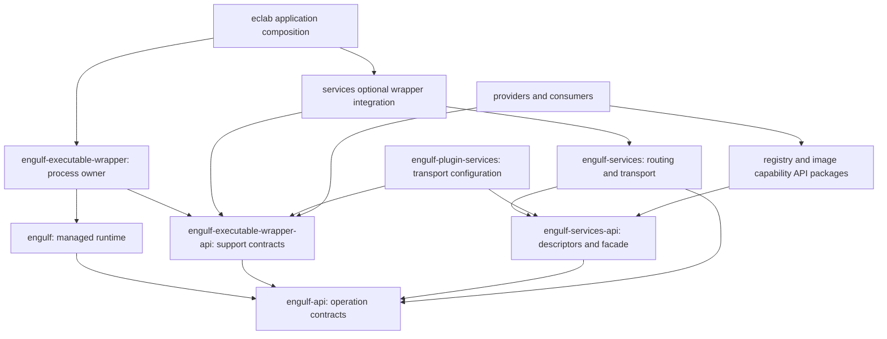

# Plugin services architecture

This directory is the active design workspace. It expands the plans and reviews in
[seed](seed/README.md) into components, contracts, interaction pseudocode, and
recursive design reviews. It describes proposed work; it does not claim that the
interfaces or services exist in the current runtime.

The [v4 critique assessment](critique-response.md) records S1–S28, source corrections,
adopted changes and remaining implementation gates. The active pages incorporate
that assessment; the incoming critique and seed documents remain historical input.

The architectural center is **owner-dispatched work**: a consumer asks a managed
operation to invoke a selected provider through Engulf's existing execution
endpoint. The provider receives its own callback API, state namespace, diagnostics,
and activation. Shared context continues to carry declared invocation data, but
does not become a registry of foreign operational objects.

## Two independently deliverable plans

The user confirmed both choices below. They are requirements, not open alternatives.

| Delivery | Result | Explicit stop point |
| --- | --- | --- |
| **A — foundation** | Publish additive generic operation and wrapper-support definitions with explicitly unavailable runtime stubs. Update owned package versions and dependency floors while retaining framework and goal catalog majors. | All existing behavior works with the upgraded package set. Operations report unavailable; supplying wrapper support fails immediately. Services need never be implemented. |
| **B — services** | Generic runtime and local services first (B1/B3/B4/B5); process support and child transport follow separately (B2/B6). | Each milestone has ownership, failure, cleanup and compatibility gates; IPC also needs an explicit child consumer and grants. Proxies follow later. |

The user also requires OS-specific behavior to live behind a **strategy pattern**,
with an explicitly unavailable Windows strategy. This does not require a working
Windows IPC implementation in B. Core operations and local services remain portable;
enabling child IPC on Windows fails clearly before allocating child resources.

Only definitions explicitly assigned to A are frozen by A. Service descriptors,
scope controls, transport internals, and capability APIs remain B design until their
consumer gates pass. A successful stub test cannot validate B's semantics. See the
[foundation boundary](foundation/README.md) and [delivery sequence](delivery/README.md).

## Component map

Every architectural component has its own directory. Its README owns its boundary;
linked subcomponent pages own the detailed contracts and pseudocode.

| Component | Owns | Does not own |
| --- | --- | --- |
| [Foundation](foundation/README.md) | Availability contracts, unsupported defaults, definition freeze, compatibility stop point | Working operations or a partially functioning broker |
| [Managed operations](managed-operations/README.md) | Generic registration, current execution frames, targeted endpoint dispatch, lock coordination, finalization and failure attribution | Capability schemas, provider selection policy, sockets |
| [Service contracts](service-contracts/README.md) | Capability/method identities, portable values and codecs, provider events, API-only client facades | Runtime discovery, live provider objects, application policy |
| [Service runtime](service-runtime/README.md) | Attributed directory, access/readiness, local routing, invocation/child scopes and dependency cleanup | OS process ownership or domain image ranking |
| [Executable support](executable-support/README.md) | Generic helper seam, process strategy, wrapper lifecycle, environment and completion integration | Service protocol parsing or business calls |
| [Transport](transport/README.md) | Transport strategy, private child endpoint, framed protocol, bounded pump/client, later explicit proxies | Plugin activation, automatic discovery or retry |
| [eclab adoption](eclab/README.md) | Application composition and registry, consumption, reclaim, image-provider migrations | Core service policy or new framework catalogs |
| [Delivery and verification](delivery/README.md) | Package manifest, staged gates, compatibility matrix, conformance and release preparation | Publishing packages as part of this documentation task |

## Dependency direction



Arrows mean imports/dependencies, not invocation direction. The optional helper is
a module/extra of `engulf-services`, not another distribution. The three services
distributions raise the public Engulf workspace count from five to eight only in B.
Core and all API packages remain OS-independent. Portable routing, framing and pump
policy depend on strategy contracts. Concrete strategies own endpoint creation,
native identity checks, byte I/O, inheritance and OS waits; the wrapper's process
strategy owns spawning, signals and reaping. The optional wrapper integration binds
the two strategies without adding a wrapper dependency to portable services.

The initial implementations are a Unix transport and Linux process strategy. The
Windows strategies report unavailable and perform no transport/process work. Select
strategies lazily at the owning runtime boundary; do not scatter OS branches through
core, service clients or providers. See [transport strategies](transport/strategies/README.md)
and [execution strategies](executable-support/strategies/README.md). Normal
in-process plugins still have the application's full OS authority; managed calls
are not isolation.

## Invocation and ownership

```mermaid
sequenceDiagram
    participant App as Application
    participant A as Consumer A
    participant Ops as Core operation runtime
    participant Router as Service handler
    participant B as Provider B endpoint
    App->>Ops: Create invocation handlers before before_goal
    App->>A: Activate A; before_goal(api_A)
    A->>Ops: api_A.operations.request(service request)
    Ops->>Ops: Verify current frame, generation, thread, locks
    Ops->>Router: handle(request, fresh operation API)
    Router->>Router: Access, codec, scope DAG, readiness checks
    Router->>Ops: dispatch(canonical CALL phase, target B)
    Ops->>B: Activate B; call(event, api_B)
    Note over A,B: A is suspended but remains active; B cannot borrow A's operation client
    B-->>Ops: Explicit immutable reply
    Ops-->>Router: Attributed contribution from B
    Router-->>A: Validated, decoded response
    App->>App: Goal work and entered after_goal hooks
    App->>Ops: Finally: close all handlers
    Ops->>Router: close(fresh operation API; caller absent)
    Router->>Ops: Close touched providers in dependency order
    App->>App: Deferred state destruction; close every API
```

Nested A → B → C calls are synchronous. Ancestors keep their activation and leases;
each descendant receives a new owner activation. An operation client is usable only
when its owner is the **currently executing** participant, not merely an active
ancestor. A handler API is similarly valid only in its own current handle/close
window. See [activation](managed-operations/activation/README.md).

Local calls begin in an invocation scope. Child-originated calls begin in a child
scope and nested provider calls inherit that scope. The child scope closes before
wrapper `after_call`; invocation services remain available through `after_goal`.
Both scopes close in mandatory core finalization, including early completion and
termination. The selectable broker enables child access only; local services do
not depend on it.

## Architectural invariants

1. Provider ownership comes from selected-plugin attribution and the execution
   endpoint. Neither payloads nor context objects choose a caller identity or API.
2. A goal registers exact immutable phases; the operation bridge dispatches only
   those canonical phases and selected, entered participants. It never imports a
   provider in response to a request.
3. Ordinary request/domain rejections remain recoverable. Actual managed defects
   latch a framework failure with the original provider attribution, even if
   a consumer catches the raised failure. Termination is preserved after cleanup.
4. Service values cross the same codec/validation boundary locally and over the
   wire. Private host scope controls are explicitly local and cannot be sent by a
   child. No state handle, API, implementation, or callable is a portable value.
5. Each resource scope maintains a caller → dependency DAG. A later reverse edge
   is rejected even when the earlier call completed. Cleanup visits consumers
   before their dependencies, attempts every touched provider, and never opens new
   dependency edges while closing.
6. Calling across a held state transaction is rejected. Ancestor external leases
   permit descendant state work but forbid additional descendant external leases.
   Finite service waits are explicit; existing `timeout=None` remains unchanged.
7. The wrapper owns the child and reaping. Transport only offers readiness and
   bounded steps on the invocation thread. Synchronous provider execution is
   cooperative and can exceed a deadline; polling intervals are not hard bounds.
8. Acknowledged registry writes have reached the completed state transaction before
   reclaim begins deletion. Unknown inventory, partial page reads, or failed commit
   acknowledgment permit no deletion. Writes compare pre-sample record bases; a
   changed inventory at the final recency check also permits no deletion. A complete
   snapshot can still become stale after that check releases its transaction;
   registry and Docker are not atomic.
9. Generic contracts carry opaque launch attachments and wait resources, never
   native fd/handle layouts. Platform strategies translate these at the OS boundary.
   Windows IPC unavailability cannot disable local service registration or calls;
   there is no automatic TCP fallback or success-shaped dummy connection.

Child grants always narrow frozen application policy, including elevated mode and
explicit executable opt-in. A connection's authority belongs to its descriptor
holder and can be delegated by the child; v1 provides no host-enforced descendant
containment. Empty grants create no endpoint. The configuration-only broker is not
the separate privileged broker described in the core operator guide.

## Vocabulary and lifetimes

| Term here | Meaning / lifetime |
| --- | --- |
| Runtime capability | A callback-bound API/state/lease handle; unusable after callback or while its owner is suspended where current-frame checks apply |
| Service capability | A domain descriptor identified by ID and major; immutable application configuration |
| Execution frame | One currently executing participant or handler window; stacked for synchronous nested calls |
| Service scope | Invocation or child resource lifetime with a dependency DAG; distinct from filesystem StateScope |
| ServiceCallContext | Immutable call facts and remaining authority/budget; not shared invocation context storage |
| Goal phase | Stable endpoint dispatch identity and order; service readiness is separate state |
| Broker | Selected child-transport configuration plugin; no privilege separation |

The existing sequence diagram shows the lifetime nesting: an Application owns frozen
definitions; each invoke owns handlers and an invocation scope; callbacks/handler
windows nest within it; a child scope closes before after_call while invocation
services survive through after_goal. Provider preparation maps may become unready
earlier, as the image contract specifies. These distinct lifetimes must not be
collapsed into one service-active boolean.

## Refinements beyond the seeds

The [review ledger](review.md) records counterexamples, design changes, and their
verification obligations. The largest refinements are current-frame ownership;
an explicit goal/plugin caller kind in the proposed foundation definitions;
canonical phase registration without pretending Python generic annotations are
runtime phase kinds; one handler for local and child control; exhaustive cleanup
that preserves the primary error; and bounded registry snapshots with a complete
read/commit barrier.

These changes are proposals within the new workspace. They do not silently amend
the archived decisions. Where a refinement changes a seed detail, its component
page and review entry explain why. The seeds remain historical input; this
architecture and its component pages are the active design.

## Reading and continuing the design

Read the component README, then its subcomponents, interaction pseudocode, and
review. Follow each review's cross-component counterexample into the owning page.
Use the [source evidence](evidence.md) to distinguish observed code from proposed
behavior and the [verification matrix](delivery/verification.md) to turn each
invariant into an acceptance gate.

The recursive review stops when a leaf has an explicit owner, bounded state,
failure/cleanup behavior, and a falsifiable acceptance case, or a named deferred
decision with a gate. This is a reviewable design baseline, not a claim that all
future design flaws have been eliminated.
